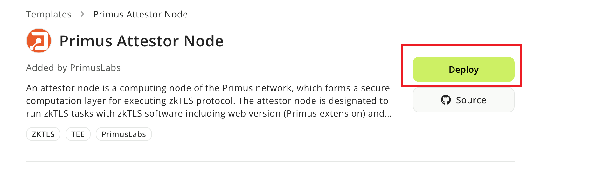
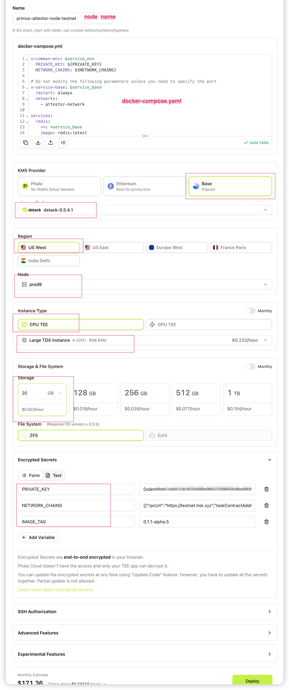
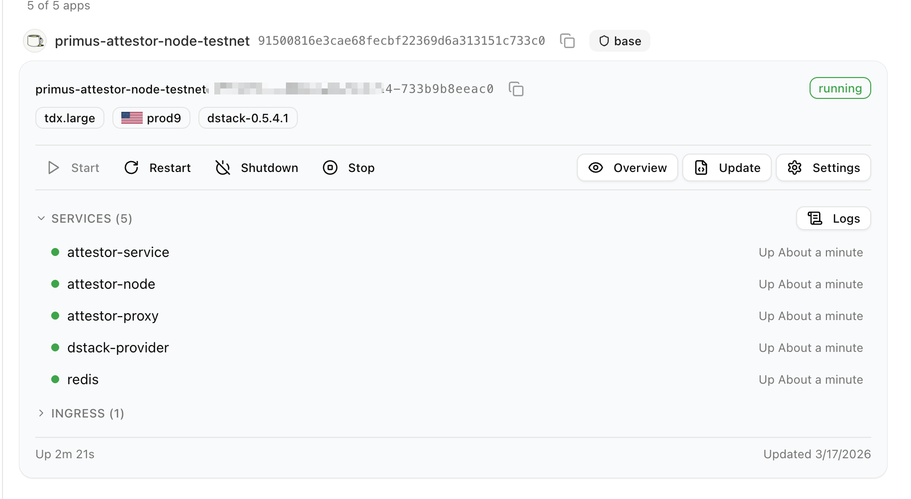
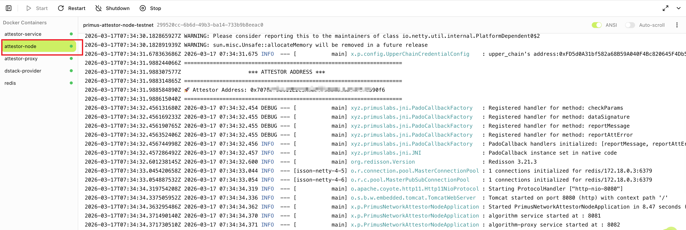
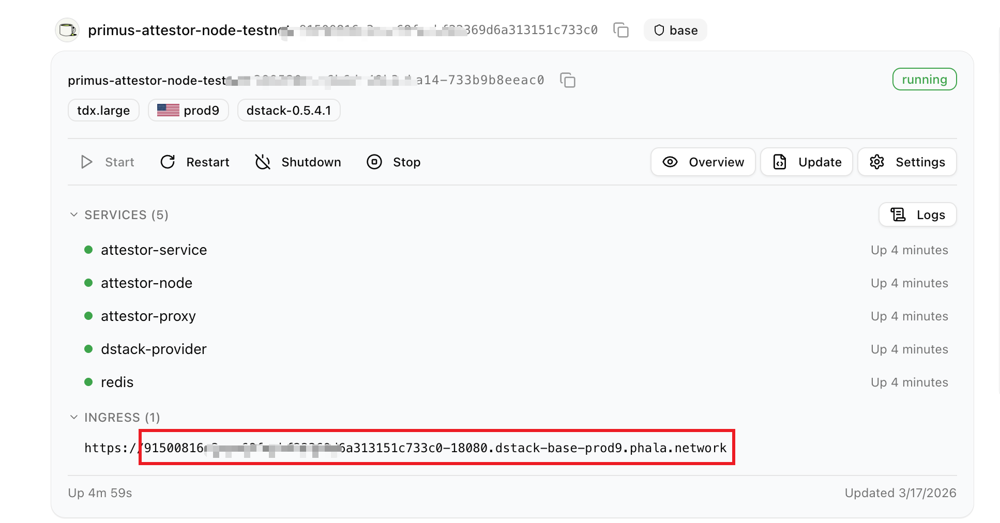
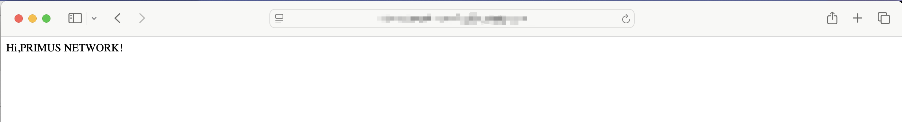

# Attestor Node Guide

This guide explains how to deploy the Primus Network Attestor Node using TEE (provided
by [Phala](https://cloud.phala.network/dashboard)) in production environments.

### 1. Supported Chains

| Chain                 | ChainId | Task Contract Address                      | Support | 
|-----------------------|---------|--------------------------------------------|---------|
| base-mainnet          | 8453    | 0x151cb5eD5D10A42B607bB172B27BDF6F884b9707 | ✅       |
| base-sepolia          | 84532   | 0xC02234058caEaA9416506eABf6Ef3122fCA939E8 | ✅       |
| hashkey-chain-testnet | 133     | 0x6588a24D34C881cF10c8DA77e282f6E1fBc262C7 | ✅       |
| hashkey-chain-mainnet | 177     | 0x1c5D0d5e0a3e0a5c9B0cDcF5C25A892281e4cd04 | ✅       |
| ink-mainnet           | 57073     | 0xCE7cefB3B5A7eB44B59F60327A53c9Ce53B0afdE | ✅       |

### 2. Deploy the Node using TEE

#### 2.1 Register a Phala Account

1. If you don't have a Phala account, you can register one [here](https://cloud.phala.network/register).

#### 2.2 Deploy the Node

##### 1. Visit the [deployment template](https://cloud.phala.network/templates/primus-attestor-node) and click
`Deploy` button.



##### 2. Please fill in the required fields:

- **Name**: This node's name.
- **docker-compose.yml**: You can find the `docker-compose.yml` file [here](./script/docker-compose.yaml). Please paste it into the `docker-compose.yml` field.
- **KMS Provider**: Only supports `Base`
- **Node**: `prod9`
- **Instance Type**: Use `Large TDX Instance(4 vCPU, 8 GB)`
- **Storage**: Larger than `20 GB`
- **Operating System**: `dstack-0.5.4.1`
- **Encrypted Secrets**: Please set:
    - `PRIVATE_KEY`. `PRIVATE_KEY` should start with `0x`. `PRIVATE_KEY`
      acts as the owner of the node, used to report results, and will also be used
      to [register the node](#3-register-the-node).
    - `NETWORK_CHAINS`: A **compressed single-line JSON string** (no line breaks). Each element has `rpcUrl`, `taskContractAddress`, and `chainId` — see [Supported Chains](#1-supported-chains).

      **Example value to paste:**
      > Here is an example for base mainnet
      ```jsonk
      [{"rpcUrl":"https://mainnet.base.org","taskContractAddress":"0x151cb5eD5D10A42B607bB172B27BDF6F884b9707","chainId":8453}]
      ```

      If you edit in expanded form, use this [tool](https://it-tools.tech/json-minify) to minify before pasting.
    - `IMAGE_TAG`: Please use the tag: `0.1.1-alpha.5`.




##### 3. Click `Deploy` to start the deployment process.

##### 4. If everything is successful, you will see the following services:



##### 5. Click the `attestor-node` service to view the node's log. You will find the attestor's address in the log.
***Please save this address as you will need it when [registering the node](#3-register-the-node)***.



##### 6. Click the `Network` tab to check your `Network Information`.
***Please save this `endpoint`  for [registering the node](#3-register-the-node)***.



##### 7. Copy the `endpoint` from step 7 to your browser and you will see the following information:


If you see `Hi, PRIMUS NETWORK!`, it means you have successfully deployed the node.

### 3. Register the Node

> ***NOTE: Before managing a node, you must first contact the [primuslabs team](https://discord.gg/YxJftNRxhh) to have the
attestor added to the whitelist.***

#### 3.1 Prerequisites

Make sure Docker is installed on your system.

#### 3.2 Clone and Prepare

```bash
git clone https://github.com/primus-labs/primus-network-startup.git
cd primus-network-startup
chmod +x ./run.sh
```

#### 3.3 Set Environment Variables

Based on the chain where your node is located, choose the matching file under `env_files/`.
You can either edit it in place or copy it to `.env` if you prefer a local working copy.

```bash
cp env_files/.env.base-mainnet .env
```

Then set your private key, RPC URL, and other parameters:

> Here is an example for base mainnet
```bash
PRIVATE_KEY=0x
 # Rpc for base chain testnet
RPC=
NODE_CONTRACT_ADDRESS=0x9C1bb8197720d08dA6B9dab5704a406a24C97642
ATTESTOR_ADDRESS=
RECIPIENT_ADDRESS=
ATTESTOR_URLS=
NODE_META_URL=
STAKE_MANAGER_ADDRESS=
```

1. **PRIVATE_KEY**: This private key owns the node and is the same as the [above](#2-please-fill-in-the-required-fields)
   while deploying the node. We recommend depositing 0.01 ETH(for base chain) to this address. If you set it as the `RECIPIENT_ADDRESS`
   below, it will automatically receive task fees. This ensures sufficient balance for reporting results. Otherwise, you
   must manually monitor and maintain the balance.
2. **RPC**: rpc for the chain.
3. **NODE_CONTRACT_ADDRESS**:  This is the address of the node contract. You can use the default value from
   `env_files/.env.base-mainnet`.
4. **ATTESTOR_ADDRESS**: Attestor's address to sign attestations, this address is from
   above [attestor-node](#5-click-the-attestor-node-service-to-view-the-nodes-log-you-will-find-the-attestors-address-in-the-log).
5. **RECIPIENT_ADDRESS**：Address to receive task fees. This address can be set to the node owner address corresponding
   to the PRIVATE_KEY above, or to any other address.
6. **ATTESTOR_URLS**: Attestor node domain names. This domain is
   from [endpoint above](#6-click-the-network-tab-to-check-your-network-information),
   and remove `https://`, just the domain name like:
   `dd26063786a0fccd8e4cc499374b4515d4df1e87-18080.dstack-base-prod9.phala.network`.If you have multiple URLs, separate
   them with commas.
7. **NODE_META_URL**: Attestor node metadata url. The metadata should be a JSON document containing the following
   fields:
8. **STAKE_MANAGER_ADDRESS**: Required for `registerAndStake`, `requestExit`, and `withdrawNodeStakeAndUnregister`.

```json
{
  "name": "Your node name",
  "description": "Introduce your node",
  "website": "Your website URL",
  "x": "https://x.com/<your_x_username>",
  "logo": ""
}
```

***MAKE SURE `NODE_META_URL` IS PUBLICLY ACCESSIBLE ON THE INTERNET.***

#### 3.4 On-chain Commands

After you finish step 3.3, use `run.sh` to call the on-chain management commands for the selected chain.
Pass the chain name to make `run.sh` load `env_files/.env.<chain-name>` directly, for example `base-mainnet`.

##### 3.4.1 Register and Stake

Use this when the node is not yet registered and you want to register it and stake the minimum required amount in one step.

> The owner wallet must have at least 10000 PRIME available for staking.

```bash
sudo ./run.sh registerAndStake base-mainnet
```

##### 3.4.2 Request Exit

Use this to mark the node as exiting and automatically unstake the current active stake from `StakeManager`.

```bash
sudo ./run.sh requestExit base-mainnet
```

After `requestExit` succeeds, wait for the chain's `unstakeCooldown` period before running `withdrawNodeStakeAndUnregister`.

##### 3.4.3 Withdraw Node Stake and Unregister

Use this only after the `unstakeCooldown` period has elapsed. This withdraws the unlocking stake and then unregisters the node.

```bash
sudo ./run.sh withdrawNodeStakeAndUnregister base-mainnet
```
