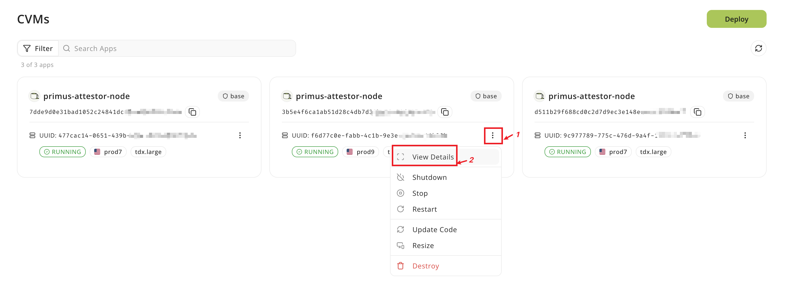
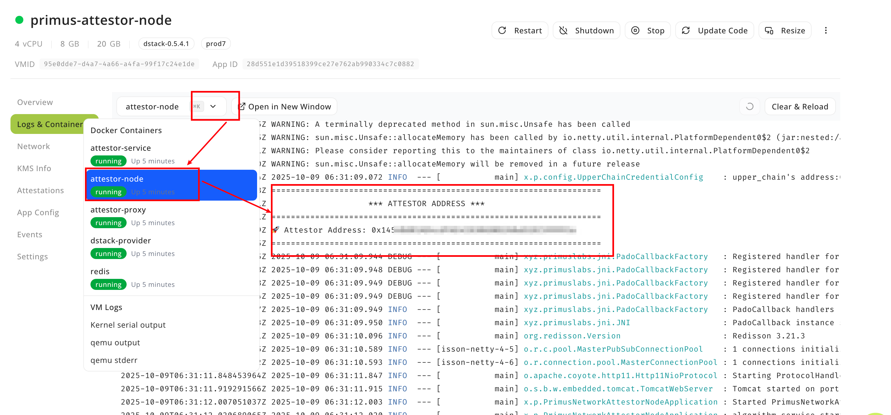
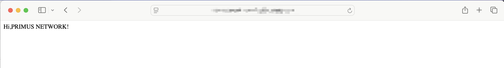

# TEE Deployment Guide

## 目录
- [1. Supported Chains](#1-supported-chains)
- [2. Deploy the Node using TEE](#2-deploy-the-node-using-tee)
  - [2.1 Register a Phala Account](#21-register-a-phala-account)
  - [2.2 Deploy the Node](#22-deploy-the-node)
- [3. Update the Node](#3-update-the-node)
- [4. Manage the Node](#4-manage-the-node)
  - [4.1 Prerequisites](#41-prerequisites)
  - [4.2 Clone and Prepare](#42-clone-and-prepare)
  - [4.3 Set Environment Variables](#43-set-environment-variables)
  - [4.4 Register the Node](#44-register-the-node)
  - [4.5 Unregister the Node](#45-unregister-the-node)
- [5. Monitoring and Logging](#5-monitoring-and-logging)
  - [5.1 View Logs](#51-view-logs)
- [6. Update Services](#6-update-services)
- [7. Reset the Environment](#7-reset-the-environment)

This guide explains how to deploy the Primus Network Attestor Node using TEE (provided by [Phala](https://cloud.phala.network/dashboard)) in production environments.

### 1. Supported Chains

| Chain             | ChainId | Support | 
|-------------------|---------|---------|
| base-sepolia      | 84532   | ✅       |

### 2. Deploy the Node using TEE
#### 2.1 Register a Phala Account

1. If you don't have a Phala account, you can register one [here](https://cloud.phala.network/register).
2. [Setup credit card](https://cloud.phala.network/setup-billing) to pay for the billing.

#### 2.2 Deploy the Node

1. Visit the [dashboard](https://cloud.phala.network/dashboard) and click `Deploy` to start a deployment process.

2. Please fill in the required fields:  
- **Name**: This node's name 
- **docker-compose.yml**: Copy [this](https://github.com/primus-labs/primus-network-startup/blob/main/docker-compose.yaml) file content.
- **KMS Provider**: Only supports `Base`
- **Node**: prod7
- **Instance Type**: Use `Large TDX Instance(4 vCPU, 8 GB)`
- **Storage**: Larger than `20 GB`
- **Operating System**: `dstack-0.5.3`
- **Encrypted Secrets**: Please set `PRIVATE_KEY`, `BASE_RPC_URL`, `BNB_RPC_URL`. `PRIVATE_KEY` should start with `0x` and please save it, you will use it to register the node.


3. Click `Deploy` to start the deployment process.
4. Click the detail button to view the deployment status.

5. If everything is successful, you will see the following services:

6. Click the `attestor-node` service to view the node's log. You will find the attestor's address in the log. Please save this address as you will need it when registering the node.

7. Click the `Network` tab to check your `Network Information`. Please save this `endpoint` (18080) for registering the node.

8. Copy the `endpoint` from step 7 to your browser and you will see the following information:

If you see `Hi, PRIMUS NETWORK!`, it means you have successfully deployed the node.


### 3. Update the Node
First you need to update the compose code file, please follow the steps below:

1. Click `...` button and choose `update code` button:


2. Copy [this](https://github.com/primus-labs/primus-network-startup/blob/main/docker-compose.yaml) file content and update compose code.


After click `Save changes` button, wallet (such as metamask) will prompt you to `confirm the update`.


### 4. Manage the Node
> ***NOTE: Before managing a node, you must first contact the [primuslabs team](https://discord.gg/YxJftNRxhh) to have the attestor added to the whitelist.***

#### 4.1 Prerequisites

Make sure Docker is installed on your system.

#### 4.2 Clone and Prepare

```bash
git clone https://github.com/primus-labs/primus-network-startup.git
cd primus-network-startup
chmod +x ./run.sh
```

#### 4.3 Set Environment Variables

Based on the chain where your node is located, run the following command:

```bash
cp env_files/.env.<chain-name> .env
```

Then set your private key, RPC URL, and other parameters:

```bash
# This private key is from the above while deploying the node
PRIVATE_KEY=0x
RPC=<Your RPC URL>
NODE_CONTRACT_ADDRESS=
# Attestor's address to sign attestations, this address is from above 'attestor-node' logs
ATTESTOR_ADDRESS=
# Address to receive rewards and fees
RECIPIENT_ADDRESS=
# Attestor node metadata
NODE_META_URL=https://api-dev.primuslabs.xyz/node1-meta.json
# Attestor node domain names. If you have multiple URLs, separate them with commas.
# This domain is from endpoint above, and remove https://, just the domain name
# Example: network-node1.primuslabs.xyz,test-network-node1-2.primuslabs.xyz
ATTESTOR_URLS=<node-domain1>,<node-domain2>
```

`NODE_META_URL` should point to a JSON document containing the following fields:

```json
{
  "name": "Your node name",
  "description": "Introduce your node",
  "website": "Your website URL",
  "x": "https://x.com/<your_x_username>",
  "logo": ""
}
```

***MAKE SURE `NODE_META_URL` IS PUBLICLY ACCESSIBLE ON THE INTERNET.***

#### 4.4 Register the Node

```bash
sudo ./run.sh register
```

#### 4.5 Unregister the Node

> If you want to unregister from the Primus network, run the following command:

***Please note***: Unregistering from the network means you will no longer receive any tasks and will not earn any income.

```bash
sudo ./run.sh unregister
```