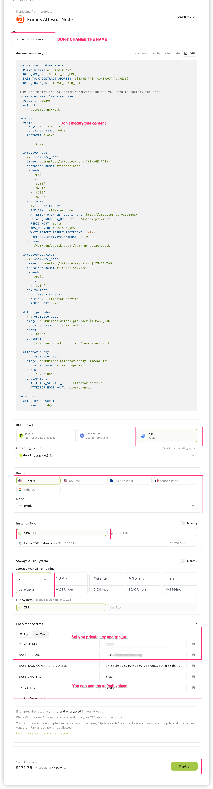
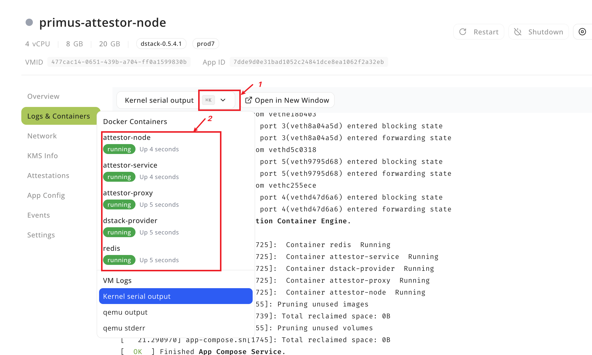
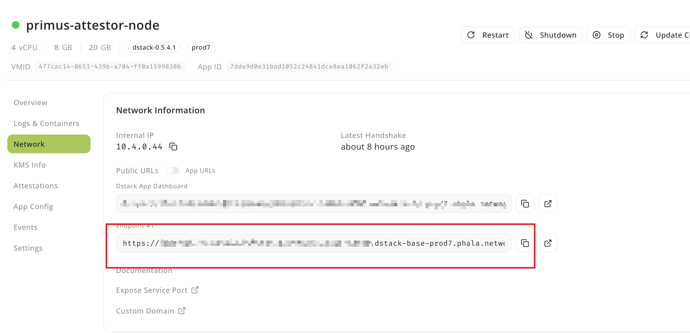

# TEE Deployment Guide

This guide explains how to deploy the Primus Network Attestor Node using TEE (provided by [Phala](https://cloud.phala.network/dashboard)) in production environments.

### 1. Supported Chains

| Chain             | ChainId | Support | 
|-------------------|---------|---------|
| base-sepolia      | 84532   | ✅       |

### 2. Deploy the Node using TEE
#### 2.1 Register a Phala Account

1. If you don't have a Phala account, you can register one [here](https://cloud.phala.network/register).

#### 2.2 Deploy the Node

1. Visit the [dashboard](https://cloud.phala.network/dashboard) and click `Deploy` to start a deployment process.

2. Please fill in the required fields:  
- **Name**: This node's name 
- **docker-compose.yml**: Copy [this](https://github.com/primus-labs/primus-network-startup/blob/main/docker-compose.yaml) file content.
- **KMS Provider**: Only supports `Base`
- **Node**: prod7
- **Instance Type**: Use `Large TDX Instance(4 vCPU, 8 GB)`
- **Storage**: Larger than `20 GB`
- **Operating System**: `dstack-0.5.3`
<a name='owner_private_key'></a>
- **Encrypted Secrets**: Please set `PRIVATE_KEY`, `BASE_RPC_URL`. `PRIVATE_KEY` should start with `0x` and please save it, you will use it to register the node.


3. Click `Deploy` to start the deployment process.
4. Click the detail button to view the deployment status.

5. If everything is successful, you will see the following services:


<a name="attestor_node_address"></a>
6. Click the `attestor-node` service to view the node's log. You will find the attestor's address in the log. ***Please save this address as you will need it when [registering the node](#34-register-the-node)***.

<a name="attestor_endpoint"></a>
7. Click the `Network` tab to check your `Network Information`. ***Please save this `endpoint` (18080) for [registering the node](#34-register-the-node)***.

8. Copy the `endpoint` from step 7 to your browser and you will see the following information:

If you see `Hi, PRIMUS NETWORK!`, it means you have successfully deployed the node.

### 3. Register the Node
> ***NOTE: Before managing a node, you must first contact the [primuslabs team](https://discord.gg/YxJftNRxhh) to have the attestor added to the whitelist.***

#### 3.1 Prerequisites

Make sure Docker is installed on your system.

#### 3.2 Clone and Prepare

```bash
git clone https://github.com/primus-labs/primus-network-startup.git
cd primus-network-startup
chmod +x ./run.sh
```

#### 3.3 Set Environment Variables

Based on the chain where your node is located, run the following command:

```bash
cp env_files/.env.<chain-name> .env
```

Then set your private key, RPC URL, and other parameters:

```bash
PRIVATE_KEY=0x
RPC=<Your RPC URL>
NODE_CONTRACT_ADDRESS=
ATTESTOR_ADDRESS=
RECIPIENT_ADDRESS=
ATTESTOR_URLS=<node-domain1>
NODE_META_URL=https://api-dev.primuslabs.xyz/node1-meta.json
```
1. **PRIVATE_KEY**: This private key is from the [above](#owner_private_key) while deploying the node
2. **RPC**: rpc for the chain.
3. **NODE_CONTRACT_ADDRESS**:  This is the address of the node contract. You can use the default value from `env_files/.env.<chain-name>`.
4. **ATTESTOR_ADDRESS**: Attestor's address to sign attestations, this address is from above [attestor-node](#attestor_node_address).
5. **RECIPIENT_ADDRESS**：Address to receive rewards and fees
6. **ATTESTOR_URLS**: Attestor node domain names.  This domain is from [endpoint above](#attestor_endpoint), and remove `https://`, just the domain name like: `dd26063786a0fccd8e4cc499374b4515d4df1e87-18080.dstack-base-prod7.phala.network`.If you have multiple URLs, separate them with commas.
7. **NODE_META_URL**: Attestor node metadata url. The metadata should be a JSON document containing the following fields:
```json
{
  "name": "Your node name",
  "description": "Introduce your node",
  "website": "Your website URL",
  "x": "https://x.com/<your_x_username>",
  "logo": ""
}
```
***MAKE SURE `NODE_META_URL` IS PUBLICLY ACCESSIBLE ON THE INTERNET.***

#### 3.4 Register the Node

```bash
sudo ./run.sh register
```